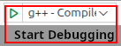
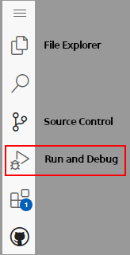
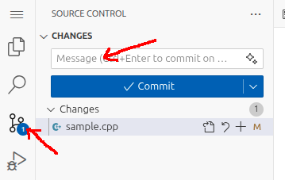

# Sample Assignment

This is a simple C++ assignment for practice using Github Classroom and
Codespaces, and for your instructor to verify that your Github account is
correctly connected to the class roster.

## Assignment Instructions

Write a C++ program that prompts for and inputs two integers, then calculates
and outputs the sum of those two integers.

Here is a sample run of the program:

```
Enter first integer: 15
Enter second integer: 22

The sum is 37.
```

Starter code is provided in file *sample.cpp*. Complete your assignment with
this source file. Replace the comment at line 1 with a comment to include
your name.

## Compiling and Running Your Program

Your instructor has set up customized *Codespaces* templates upon which all
assignments for the course are based.
The templates include actions to build and run your program/project with the
symbolic debugger. Also, the C++ compiler is configured to detect uninitialized
variables and to trigger a compiler error on warnings (i.e. if the compiler
generates a warning message, it is treated as an error and does not
successfully build).

The templates include a custom build task. To build and run your program,
use the *Run and Debug* button on the left-side toolbar, or press
*CTRL+SHIFT+D*. This opens the *Run and Debug* panel. At the top you will see
green *Start Debugging* button
and a drop-down box to the right. There
is usually no need to change the option in the drop-down box (unless directed
otherwise by your instructor or the particular assignment instructions).





Depending on the template upon which the project is based, the *Start Debugging*
button might build and run the file currently opened in the editor, or it
might build and run a multiple-source-file project. Some projects may be
include multiple build configurations. Your instructor will advise accordingly.

## Managing Your Repository

When you accept an assignment, a repository is created on Github for you.
When you create a Codespace on a repository, a virtual environment is created
for you and that environment contains a copy of your repository. Changes you
make in *Codespaces* are local to the environment's copy; changes are not
automatically sent to the Github repository.

It is important that you *push* changes in your Codespace repository to
the upstream Github repository. Your instructor has access to the Github
repository, but cannot access your Codespace repository.
For assignments, be sure to push changes to the upstream Github repository
prior to the due date for the assignment.
Your instructor configures assighments such that the upstream repositories
cannot be updated past the due date.

Saving changes to the upstream repository is a two-step process; first you
commit changes (local to the Codespace), then you *push* changes (to the upstream
repository). This can be done with the Codespace IDE (integrated development
environment) or by the command line.

### Commit and Push with the IDE

Open the *Source Control* panel with the button on the left-side toolbar.
You will see a message box with a *Commit* button underneath.
Enter a short message that describes the changes you made (the message content
is not critical for assignments; a simple "completed assignment" will do).
Then, click *Commit*. This saves the changes to the local Codespace repository;
the changes are *not* saved to the upstream Github repository, and as such
are not yet submitted to your instructor.



If you forget to enter a message before you click *Commit*, Codespaces will
open an editor window for you to enter the message. If this happens, simply
enter your message in the first line of the editor window and close it.
That should complete the commit process.


After a successful commit, you need to push your changes to the upstream
repository. The commit button will have changed to read *Sync Changes*.
Just click *Sync Changes* and the changes will
be sent and saved to the upstream repository.

### Commit and Push with the Command Line

If you prefer to use the command line, you can commit and push your changes
as follows:

```
git commit -a -m "completed assignment"
git push
```

### Resolving Conflicts

Occasionally you may encounter an error when using the *Sync Changes* button
or the `git push` command. This may happen when
changes were made to the upstream repository that are not in your local
Codespace repository. (Possibly because two different Codespaces were opened
on the same repository.)

When this happens, you will see an up-arrow and down-arrow on the 
*Sync Changes* button and you will get an error message while attempting
to push.


Most often this can be resolved by doing a *pull* with a *rebase*. This will
pull the changes from the upstream repository to the local repository, then
complete the push. Try this command:

```
git pull -r
```

If this works you will get a "Successful rebase" message, then be sure
to push (or *Sync Changes*) afterward.

If this command does not work, then you will likely need to resolve conflicts
between the two repositories. If you are unfamiliar with resolving such
issues, seek out your instructor or someone well-versed with *git* for help.

## Submitting Your Assignment

By ensuring that your changes are saved to the upstream Github repository,
you can rest assured that your assignment is submitted. To be sure that
everything is in sync between the local (Codespaces in this case) repository
and the Github repository, you can use this command at the command line:

```
git fetch; git status
```

If you see a message that says "Your branch is up to date...", then your
repositories are in sync and your instructor can access your latest version.
If the messages says otherwise ("Your branch is ahead..." or
"Your branch is behind..."), you need to resolve the issue.

If you have finished the assignment and your repositories are in sync, your
assignment is submitted and no further action is necessary. However, if you 
decide to make changes after-the-fact (and before the due date), you can do
so but be sure to sync with the upstream repository when you are done.

Note that your instructor sets up assignments on Github Classroom such that
they cannot be submitted past the due date; once the due date passes, Github
removes permissions for you to push to the upstream repository. So give
yourself plenty of time to complete your assignments and ensure they are
submitted prior to the due date.
